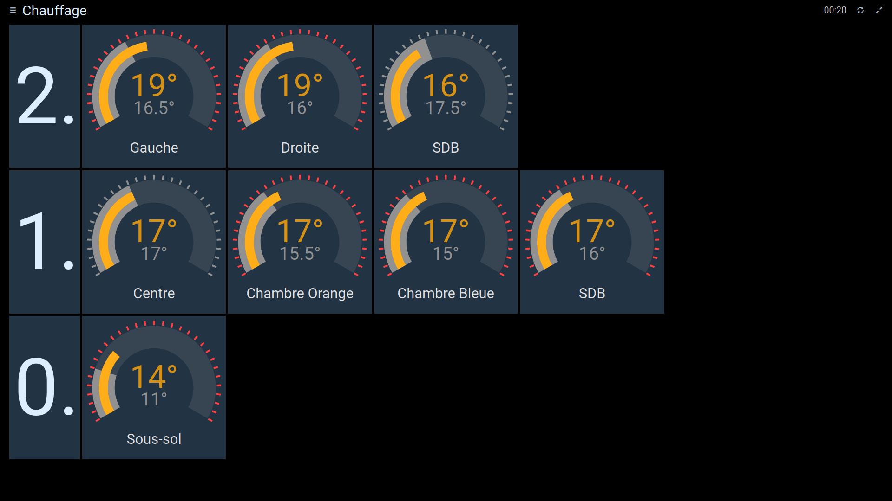
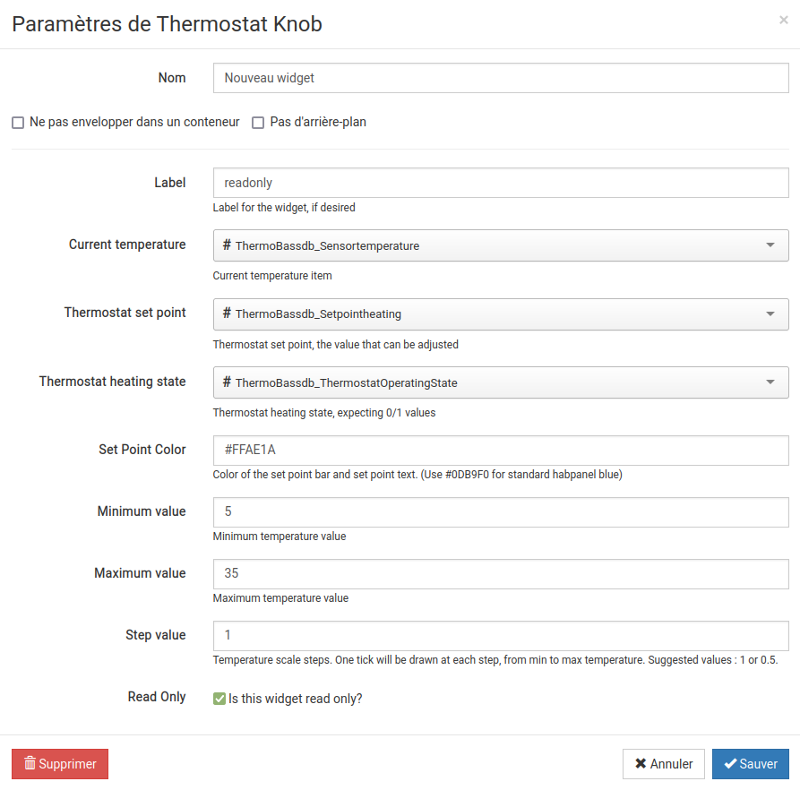

# habpanel-thermoKnob-widget

Thermostat Knob for Habpanel (OpenHAB)
Allows adjusting setpoint temperature while viewing current room temperature and heating state.

## Features

The thermo-knob connects to 3 openhab items:
- temperature setpoint, which is adjustable
- Current temperature, displayed only
- Current heating state (0/1), displayed only

### Parameters

The widget can be configured as follow:
- An optional label can be added to the widget.
- The temperature scale is configurable (min, max, step).
- The color of the setpoint temperature can be changed.

Other parameters that must be changed *manually*:
- you can change the *heating color* by changing the *colorH* setting inside file ng-knob-thermo.js
- Other parameters can be adjusted as in the knob widget (see [ng-knob](https://github.com/RadMie/ng-knob) )

## Screenshot

## Settings

(sorry for the mixture of languages)

## Demo

A standalone demo is provided in [thermoKnob/index.html](thermoKnob/index.html)

## Installing

This widget relies on static files, which must be installed manually.
Simply copy the directory thermoKnob into the static html area of openhab.

For openraspbian, just do

`cp -r thermoKnob /etc/openhab2/html/`

If you install the file elsewhere, make sure you adjust the widget [thermo-knob.widget.json](thermo-knob.widget.json) file accordingly.

